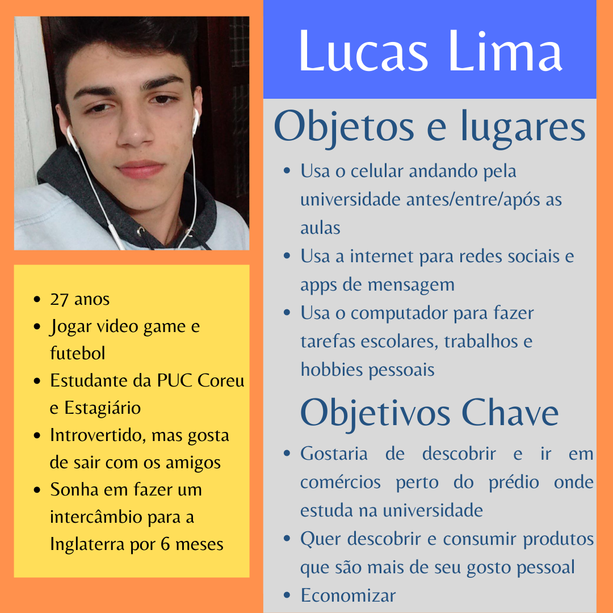
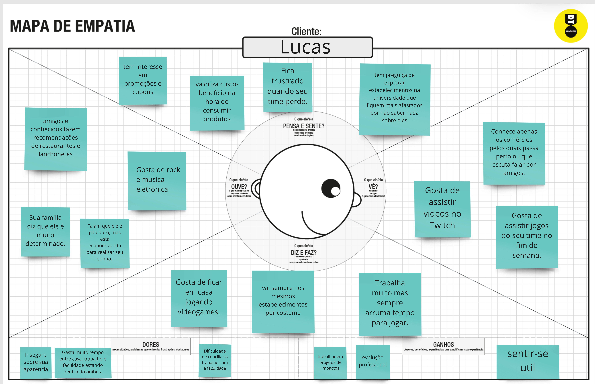
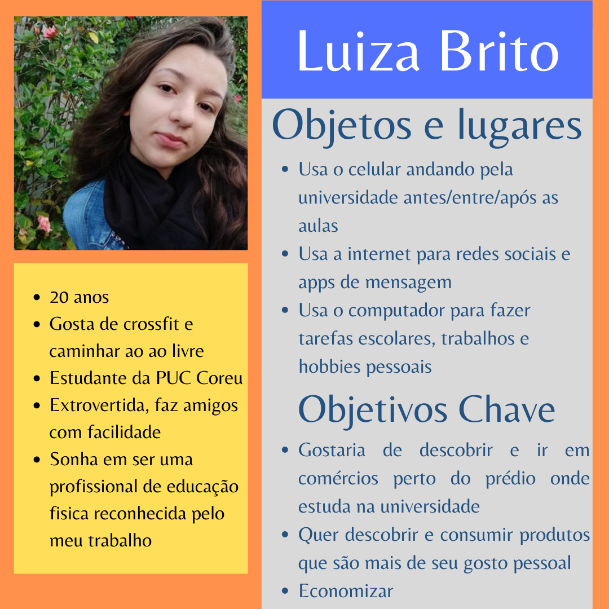
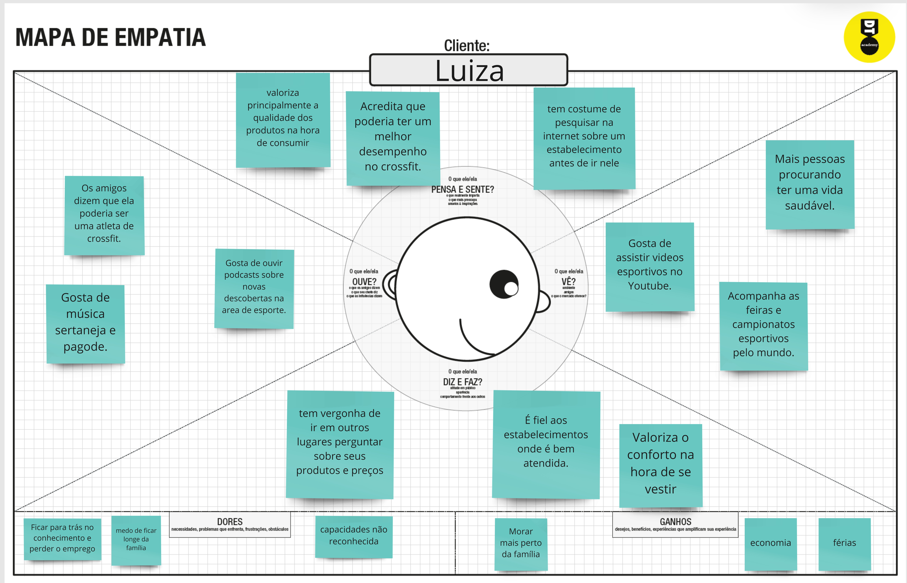
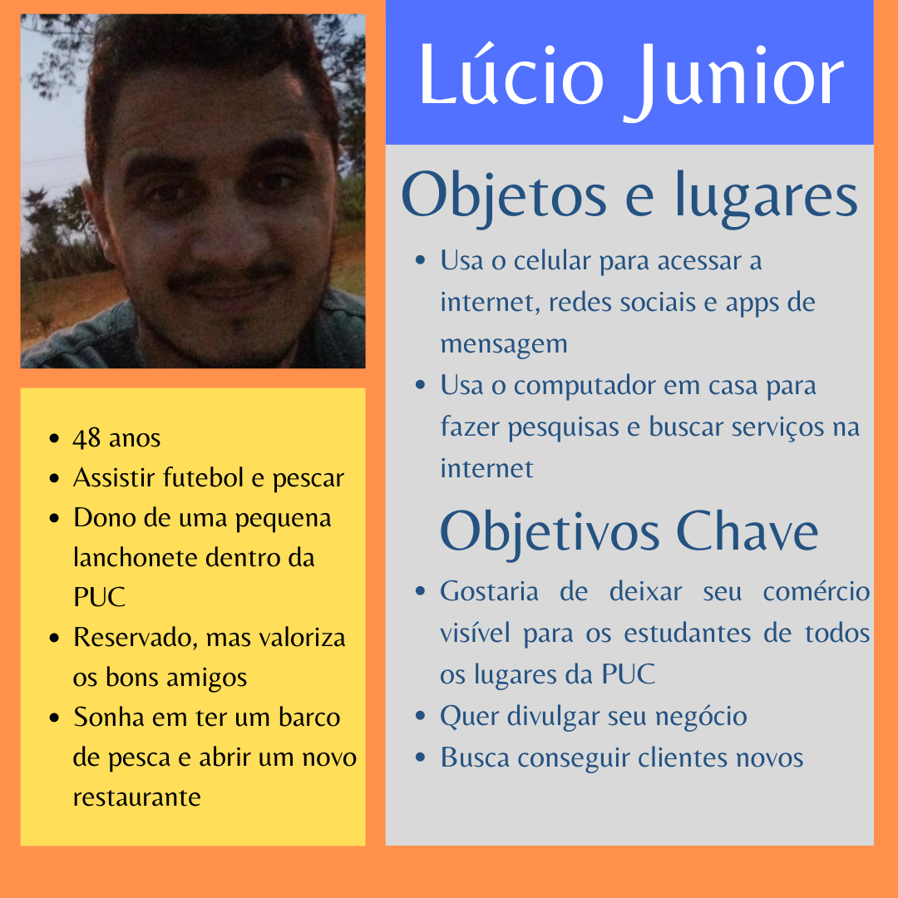
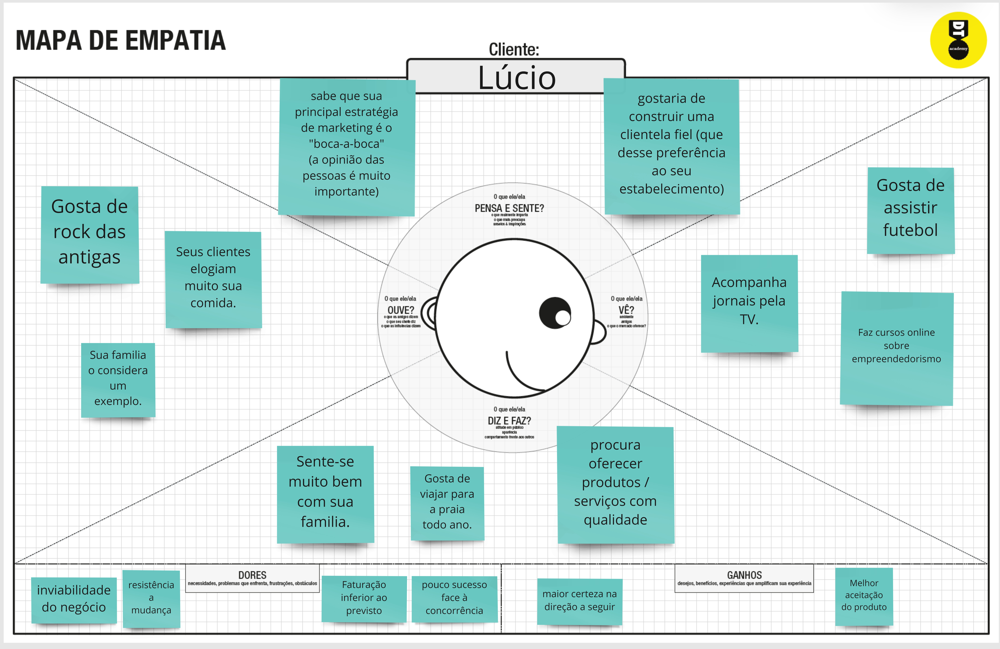

# Informações do Projeto

`TÍTULO DO PROJETO`

O que Tem? PUC - Coreu

`CURSO`

Ciência da Computação

## Participantes

- Helena Ferreira Fernandes

- Matheus Pimentel Kansaon

- Olga Camilla Silva Teodoro

- Vinicius Augusto Alves Santos Mello

# Estrutura do Documento

- [Informações do Projeto](#informações-do-projeto)
  - [Participantes](#participantes)
- [Estrutura do Documento](#estrutura-do-documento)
- [Introdução](#introdução)
  - [Problema](#problema)
  - [Objetivos](#objetivos)
  - [Justificativa](#justificativa)
  - [Público-Alvo](#público-alvo)
- [Especificações do Projeto](#especificações-do-projeto)
  - [Personas e Mapas de Empatia](#personas-e-mapas-de-empatia)
  - [Histórias de Usuários](#histórias-de-usuários)
  - [Requisitos](#requisitos)
    - [Requisitos Funcionais](#requisitos-funcionais)
    - [Requisitos não Funcionais](#requisitos-não-funcionais)
  - [Restrições](#restrições)
- [Projeto de Interface](#projeto-de-interface)
  - [User Flow](#user-flow)
  - [Wireframes](#wireframes)
- [Metodologia](#metodologia)
  - [Divisão de Papéis](#divisão-de-papéis)
  - [Ferramentas](#ferramentas)
  - [Controle de Versão](#controle-de-versão)
- [**############## SPRINT 1 ACABA AQUI #############**](#-sprint-1-acaba-aqui-)
- [Projeto da Solução](#projeto-da-solução)
  - [Tecnologias Utilizadas](#tecnologias-utilizadas)
  - [Arquitetura da solução](#arquitetura-da-solução)
- [Avaliação da Aplicação](#avaliação-da-aplicação)
  - [Plano de Testes](#plano-de-testes)
  - [Ferramentas de Testes (Opcional)](#ferramentas-de-testes-opcional)
  - [Registros de Testes](#registros-de-testes)
- [Referências](#referências)

# Introdução

## Problema

Com quase 340 mil metros quadrados, o campus da PUC MINAS Coração Eucarístico possui dezenas de prédios,
muitos deles contendo comércios na área de alimentação como lanchonetes e restaurantes, além dos vários estabelecimentos
que existem em suas proximidades. Entretanto, não 
existe nenhum método de fácil acesso que mostre a localização e identificação desses estabelecimentos dentro 
da universidade. Além disso, cada um desses comércios oferecem serviços e produtos diferentes com preços únicos.

Através de entrevistas com funcionários e proprietários de alguns desses comércios, identificamos que o maior
fator que leva as pessoas a serem clientes desses estabelecimentos é a proximidade do lugar com
os lugares frequentados pelo cliente dentro da universidade. Além disso, para grande parte deles, a maior estratégia 
de marketing, sendo muitas vezes a única, é o "boca-a-boca", o fato de que seus clientes acabam recomendando o lugar
para seus amigos e conhecidos.

Também fizemos entrevistas com alunos e funcionários do campus, nas quais vimos que aproximadamente 60% destes desconhecem 
os serviços e produtos oferecidos na região, como alimentos, preços, promoções e atrações. Foram identificados quatro maiores 
motivos para isso:

- Falta de tempo para explorar o campus;
- Praticidade de ir onde já conhecem ou ir apenas em locais perto dos prédios onde estudam ou trabalham;
- Preconceito em relação ao preço;
- Vergonha de explorar os comércios.

Esse desconhecimento também leva muitas pessoas a não ter vontade alguma de explorar os comércios na universidade e a
trazer seus próprios alimentos ou se alimentar em casa.

A pesquisa também revelou que, apesar desses motivos, a maioria dos estudantes gostariam de saber mais informações 
sobre os restaurantes, lanchonetes e bares dentro e nas proximidades do campus.

É possível, então, identificar o problema da falta de disseminação de informações sobre os comércios alimentícios do campus, que 
objetivamos analisar neste projeto.

## Objetivos

O principal objetivo deste projeto é criar uma solução que permita aos alunos e funcionários da PUC MINAS Coração Eucarístico 
terem acesso a informações sobre restaurantes, lanchonetes e bares dentro e próximos ao campus com facilidade e sem constrangimento.

Com isso, este projeto também visa:

- Proporcionar uma melhor vivência no campus aos alunos e funcionários da PUC;
- Possibilitar aos comércios a obtenção de novos clientes;

## Justificativa

O problema da falta de disseminação de informações sobre os comércios alimentícios do campus dificulta aos 
estudantes conhecer e aproveitar as oportunidades nessa área na universidade que frequentam e dificulta aos
comércios a obtenção de novos clientes. 

Além disso, pelo fato da universidade ter ficado quase 2 anos sem atividades presenciais por causa da pandemia, grande parte
dos alunos que a frequentam atualmente não conhecem muito o local, o que diminuiu bastante o "boca-a-boca", que era muito importante 
para os estabelecimentos serem descobertos pelas pessoas.

A criação de uma solução para esse problema permitirá aos alunos terem acesso a essas informações e, consequentemente, 
ter uma maior chance de aproveitar seu tempo de estudante na universidade. Ela também será uma forma para que os comércios 
possam expor seus produtos e serviços e fazendo com que mais pessoas os conheçam.

## Público-Alvo

O público-alvo deste projeto é composto pelas pessoas que frequentam o campus da PUC MINAS Coração Eucarístico como alunos, professores
e funcionários e também os proprietários ou funcionários de restaurantes, lanchonetes e bares dentro e ao redor
do campus.

# Especificações do Projeto

Para podermos definir quem eram as personas que usariam nosso aplicativo, realizamos uma pesquisa presencial com 45 alunos da PUC MINAS Coração Eucarístico. Conversamos com alunos de diversos cursos e periodos para podermos entender quais eram suas necessidades E desejos em relação ao consumo de alimentos dentro e fora da universidade. Conversamos também com proprietários e funcionários de 10 estabelecimentos dentro e ao redor do campus da PUC.

Além disso, uma pesquisa feita em 2014 pela rede colaborativa para estudantes universitários Passei Direito e publicada pelo Correio Braziliense (que pode ser conferida em https://www.correiobraziliense.com.br/app/noticia/eu-estudante/ensino_ensinosuperior/2014/10/07/ensino_ensinosuperior_interna,451143/pesquisa-mostra-como-estudantes-usam-smartphone-para-estudar.shtml) apontou que quase 95% deles utilizam
smartphones com acesso à internet. 

Com base na necessidade de praticidade levantada pelos alunos e funcionários e no fato de que a grande maioria 
dessas pessoas tem acesso à internet em praticamente qualquer lugar da universidade por causa dos smartphones que carregam, foi definido que o projeto
seria a criação de um site otimizado para o meio mobile no qual seja possível às pessoas visualizarem informações sobre os comércios alimentícios nas proximidades
do campus colocadas pelos próprios estabelecimentos através do cadastro de sua loja.

## Personas e Mapas de Empatia

> 1.  Primeira persona e mapa de empatia
>
>  > 
>
> 2.  Segunda persona e mapa de empatia
>
>  > 
>
> 3.  Terceira persona e mapa de empatia
>
>  > 

## Histórias de Usuários

Com base na análise das personas forma identificadas as seguintes histórias de usuários:

| EU COMO... `PERSONA` | QUERO/PRECISO ... `FUNCIONALIDADE`                                                   | PARA ... `MOTIVO/VALOR`                                                                        |
| -------------------- | ------------------------------------------------------------------------------------ | ---------------------------------------------------------------------------------------------- |
| Lucas                | Praticidade em achar comércios que fiquem perto do prédio que estudo na universidade | Não gastar muito tempo procurando saber onde eu posso economizar mais                          |
| Luiza                | Descobrir comércios que fiquem perto do prédio que estudo na universidade            | Saber onde eu posso economizar mais e consumir produtos segundo meu gosto pessoal              |
| Lúcio                | Divulgar meu negócio                                                                 | Deixá-lo visível e atrativo para todos os estudantes da PUC e, assim, conseguir novos clientes |

## Requisitos

As tabelas que se seguem apresentam os requisitos funcionais e não funcionais que detalham o escopo do projeto.

Requisitos funcionais são todas as necessidades, características ou funcionalidades esperadas em um processo que podem ser atendidos pelo software.

Já os Requisitos Não Funcionais definem como o sistema fará.

### Requisitos Funcionais

| ID     | Descrição do Requisito                                             | Prioridade |
| ------ | ------------------------------------------------------------------ | ---------- |
| RF-001 | Permitir que o aluno utilize o aplicativo sem fazer login          | ALTA       |
| RF-002 | Permitir o cadastro do aluno e comerciante com email e senha       | ALTA       |
| RF-003 | Permitir alteração dos dados de cadastro dos alunos e comerciantes | ALTA       |
| RF-004 | Permitir que o aluno favorite o estabelecimento.                   | BAIXA      |
| RF-005 | Permitir que o aluno visualize a lista de favoritos                | BAIXA      |
| RF-006 | Permitir que o aluno pesquise pelo produto que ele quer consumir   | MÉDIA      |
| RF-007 | Permitir o compartilhamento de ofertas pelo WhatsApp               | MÉDIA      |
| RF-008 | Permitir que o comerciante cadastre/altere/exclua suas ofertas     | ALTA       |
| RF-009 | Permitir que o comerciante veja uma relação de ofertas cadastradas | ALTA       |
| RF-010 | Permitir que o comerciante veja o valor da assinatura mensal       | BAIXA      |
| RF-011 | Permitir que o comerciante emita o boleto de assinatura mensal     | BAIXA      |
| RF-012 | Permitir que o comerciante veja o histórico de pagamento           | BAIXA      |
| RF-013 | Permitir que o comerciante coloque um link para seu site externo   | ALTA       |
| RF-014 | Permitir que o comerciante insira data final nas ofertas           | ALTA       |

### Requisitos não Funcionais

| ID      | Descrição do Requisito                                | Prioridade |
| ------- | ----------------------------------------------------- | ---------- |
| RNF-001 | O sistema deve ser mobile first                       | ALTA       |
| RNF-002 | Deve carregar página inicial em no máximo 3s          | MÉDIA      |
| RNF-003 | Deve ser multiplataforma (IOS/Android/Windows/MacOS ) | ALTA       |
| RNF-004 | Deve estar disponivel offline                         | MÉDIA      |
| RNF-005 | Deve ser desenvolvido em HTML, CSS e Javascript       | ALTA       |
| RNF-006 | Deve retornar resultado de pesquisa em no máximo 3s   | MÉDIA      |
| RNF-007 | Deve suportar aumento do número de cadastros          | MÉDIA      |
| RNF-008 | Servidor deve suportar 1000 requisições por hora      | ALTA       |
| RNF-009 | Deve excluir ofertas vencidas automaticamente         | MÉDIA      |

> Links externos:

- [PUC MINAS em números.](https://www.pucminas.br/AdministracaoSuperior/Secretarias/Documents/puc_numeros_2019_02.pdf)

## Restrições

O projeto está restrito pelos itens apresentados na tabela a seguir.

| ID  | Restrição                                             |
| --- | ----------------------------------------------------- |
| 01  | O projeto deverá ser entregue até o final do semestre |
| 02  | O desenvolvimento do site não pode ser terceirizado   |

# Projeto de Interface

O objetivo do site é oferecer aos alunos e funcinários da PUC Coração Eucarístico um acesso
fácil às informações sobre os restaurantes, bares e lanchonetes dentro e próximos à universidade.
Pensando nisso e no fato de que essas pessoas usariam o site principalmente pelo celular enquanto
se movimentam pelo campus, o projeto de interface foi feito com foco inicial no uso do site em
aparelhos móveis, pois a interface no mobile é a que será mais utilizada.
Um site fácil de ser usado no celular também é importante para as lojas que o utilizem, pois serão
capazes de fazer seu cadastro, login e editar suas informações e produtos de forma prática e sem a
necessidade de um computador ou notebook.

A interface do site começa em uma tela inicial que permite o usuário fazer seu cadastro, entrar em
sua conta ou ir diretamente para a tela principal onde pode ver ou pesquisar informações sobre os
estabelecimentos e produtos.
A tela principal possui uma barra de pesquisa, uma área para novas ofertas e uma lista dos
estabelecimentos cadastrados com seu nome e palavras-chave sobre si. Também conta com um fácil
filtro para estabelecimentos dentro ou perto da universidade, para tornar a experiência do usuário
mais prática.
As telas de log in, cadastro para lojas e cadastro para consumidores possuem poucos elementos para
simplificar e tornar esse processo mais agradável aos usuários.

O protótipo interativo no Figma pode acessado no link:
https://www.figma.com/proto/9usSICVL1KvVK5G0IHVH3I/O-que-tem%3F---PUC-Coreu?node-id=0%3A2&scaling=scale-down&page-id=0%3A1&starting-point-node-id=0%3A2

## User Flow

## Wireframes

Aqui são mostradas os wireframes das principais telas do site.

# Metodologia

O método "Design Thinking" foi utilizado na fase de concepção do projeto.
Já na fase de desenvolvimento, a forma de gerenciamento escolhida pela equipe foi o Scrumban.

## Divisão de Papéis

> ### Scrum Master
>
> - Rommel Vieira Carneiro
>
> ### Product Owner
>
> - Julio Cesar Dillinger Conway
>
> ### Equipe de Desenvolvimento
>
> - Helena Ferreira Fernandes
> - Matheus Pimentel Kansaon
> - Olga Camilla Silva Teodoro
> - Vinicius Augusto Alves Santos Mello
> 
> ex-Membro da equipe: Saulo Braga Silveira, fez parte da idealização do projeto na Sprint 1, mas deixou o curso por motivos pessoais.

## Ferramentas

| Ambiente                    | Plataforma      | Link de Acesso                                                                                                                                          |
| --------------------------- | --------------- | ------------------------------------------------------------------------------------------------------------------------------------------------------- |
| Processo de Design Thinkgin | Miro            | https://miro.com/app/board/uXjVOB3aPNI=/                                                                                                                |
| Repositório de código       | GitHub          | [GitHub](encurtador.com.br/clvHP>)                                                                                                                      |
| Hospedagem do site          | Replit          | https://replit.com/                                                                                                                                     |
| Protótipo Interativo        | Figma           | https://www.figma.com/proto/9usSICVL1KvVK5G0IHVH3I/O-que-tem%3F---PUC-Coreu?node-id=0%3A2&scaling=scale-down&page-id=0%3A1&starting-point-node-id=0%3A2 |
| Editor de código            | Vs code         | https://code.visualstudio.com/                                                                                                                          |
| Ferramenta de comunicação   | WhatsApp        | [whatsApp](encurtador.com.br/lpsS1)                                                                                                                     |
| Ferramenta de comunicação   | Microsoft Teams | [Teams](encurtador.com.br/vKN79)                                                                                                                        |

> As ferramentas empregadas no projeto são:
>
> - Visual studio code.
> - WhatsApp.
> - Figma.
> - Replit.
> - Microsoft Teams
> - GitHub

O editor de código foi escolhido porque ele possui uma integração com o
sistema de versão. As ferramentas de comunicação utilizadas possuem
um fácil manuseio por isso foram selecionadas. Por fim, para criar
diagramas utilizamos o figma por melhor captar as
necessidades da nossa solução.

## Controle de Versão

A ferramenta de controle de versão adotada no projeto foi o
[Git](https://git-scm.com/), sendo que o [Github](https://github.com)
foi utilizado para hospedagem do repositório `upstream`.

O projeto segue a seguinte convenção para o nome de branchs:

- `master`: versão estável já testada do software
- `unstable`: versão já testada do software, porém instável
- `testing`: versão em testes do software
- `dev`: versão de desenvolvimento do software

Quanto à gerência de commits cada desenvolvedor tem a sua autononomia, porém deve-se respeitar
o propósito de cada branch.

Os merges são utilizados para a unificação, sendo executado somente após a finalização dos testes, também
por medida de segurança ao efetuar um merge é realizado o pull requests para averiguação das mundanças.
Em relação as tags
ou issues a equipe optou por não utilizar neste primeiro momento.

# **############## SPRINT 1 ACABA AQUI #############**

# Projeto da Solução

A partir das informações coletadas nas entrevistas, vimos que a melhor solução para o problema da falta de informações sobre restaurantes e lanchonetes da PUC MINAS - Coração Eucarístico deveria ser gratuita, intuitiva e de fácil acesso em aparelhos móveis. Com isso, idealizamos o "O que tem? Puc Coreu", um site que pode ser acesso sem e com login para ver informações, produtos e novidades desse tipo de comércio da PUC. Essas informações são colocadas pelos próprios estabelecimentos, atráves de um cadastro que eles fazem na plataforma.

## Tecnologias Utilizadas

As tecnologias fundamentais para o desenvolvimento da aplicação foram as linguagens HTML, CSS e a framework Bootstrap que estão presentes em toda a interação do usuário com a ferramenta. O Javascript do site foi criado e personalizado de acordo com a funcionalidade de cada página e todos os dados foram armazenados no localstorage para ter uma interação dinâmica entre as páginas do site. Toda essa locação de dados de um lugar para o outro, tratamento de erros e contato entre usuário e aplicação é feito em JavaScript, principalmente o cadastro de informações, em que o consumidor e a loja fazem seu registro de pessoa ou restaurante e, nesse último caso, registro de produtos em sua página.

## Arquitetura da solução

...... COLOQUE AQUI O SEU TEXTO E O DIAGRAMA DE ARQUITETURA .......

> Inclua um diagrama da solução e descreva os módulos e as tecnologias
> que fazem parte da solução. Discorra sobre o diagrama.
>
> **Exemplo do diagrama de Arquitetura**:
>
> (images/diagrama.png)

# Avaliação da Aplicação

A fase de testes se deu por meio de um planejamento de funções, análise de cenários importantes e uma bateria de testes realizada por 4 pessoas diferentes afim de encontrar possíveis erros ou falhas. Os cenários de realização dos testes da aplicação, estão registrados na seção seguinte (Plano e Registros de Testes).

## Plano e Registro de Testes

| PÁGINA                   | TESTE A SER EXECUTADO                                                                     | RESULTADO ESPERADO                                                                                                 | RESULTADO ENCONTRADO                             |
|--------------------------|-------------------------------------------------------------------------------------------|--------------------------------------------------------------------------------------------------------------------|--------------------------------------------------|
| index.html               | Clicar no botão "Fazer login"                                                             | Ser redirecionado para página de Login                                                                             | Redirecionamento conforme esperado               |
| index.html               | Clicar no botão "Cadastrar"                                                               | Ser redirecionado para página para escolher se o cadastro será de loja ou consumidor                               | Redirecionamento conforme esperado               |
| login.html               | Fazer login com conta de consumidor existente: Lucas_martins@.com e senha: 123            | Ser direcionado para página inicial do sistema                                                                     | Redirecionamento conforme esperado               |
| login.html               | Fazer login com conta de consumidor inexistente: testar qualquer email e senha            | Surgimento de pop-up na tela informando que email ou senha estão incorretos.                                       | Pop-up conforme esperado                         |
| login.html               | Fazer login com conta de loja existente: restauranteNova_praca@novapraca.com e senha: 123 | Ser direcionado para a página de produtos cadastrados para este restaurante                                        | Redirecionamento conforme esperado               |
| login.html               | Fazer login com conta de loja inexistente: testar qualquer email e senha                  | Surgimento de pop-up na tela informando que email ou senha estão incorretos.                                       | Pop-up conforme esperado                         |
| cadastro.html            | Clicar no botão "Sou consumidor"                                                          | Ser redirecionado para página de cadastro de cliente                                                               | Redirecionamento conforme esperado               |
| cadastro.html            | Clicar no botão "Sou loja"                                                                | Ser redirecionado para página de cadastro de fornecedor                                                            | Redirecionamento conforme esperado               |
| cadastrocliente.html     | Digitar email de conta já existente                                                       | Informar que cadastro já existe                                                                                    | Sistema permite o cadastro com emails iguais     |
| cadastrocliente.html     | Digitar senha igual para os dois campos                                                   | Realizar cadastro e ser direcionado para página de login                                                           | Redirecionamento conforme esperado               |
| cadastrocliente.html     | Digitar senha diferente para os dois campos                                               | Surgimento de pop-up na tela informando que as senhas estão diferentes                                             | Pop-up conforme esperado                         |
| cadastrofornecedor1.html | Digitar email de conta já existente                                                       | Informar que cadastro já existe                                                                                    | Sistema permite o cadastro com emails iguais     |
| cadastrofornecedor1.html | Digitar senha diferente para os dois campos                                               | Surgimento de pop-up na tela informando que as senhas estão diferentes                                             | Sistema permite o cadastro com senhas diferentes |
| cadastrofornecedor2.html | Deixar campos em branco e clicar em adicionar produtos                                    | Erro solicitando o preenchimento dos campos                                                                        | Sistema permite cadastro sem preencher os campos |
| cadastrofornecedor2.html | Preencher os campos e clicar em adicionar produtos                                        | Ser redirecionado para página com lista de produtos                                                                | Redirecionamento conforme esperado               |
| cadastroproduto.html     | Clicar no botão "Adicionar"                                                               | Ser redirecionado para página produto detalhes                                                                     | Redirecionamento conforme esperado               |
| cadastroproduto.html     | Clicar no botão "Visualizar/Editar" sem clicar sobre o produto desejado                   | Surgimento de pop-up na tela informando que o produto não foi selecionado.                                         | Pop-up conforme esperado                         |
| cadastroproduto.html     | Clicar no botão "Visualizar/Editar" tendo clicado sobre o produto desejado                | Ser redirecionado para página produto detalhes                                                                     | Redirecionamento conforme esperado               |
| cadastroproduto.html     | Clicar no botão "Excluir"                                                                 | Surgimento de pop-up na tela informando produto foi excluido. Ao clicar em ok a lista de produtos será atualizada. | Sistema funcionando como esperado.               |
| cadastroproduto.html     | Clicar no botão "Logout"                                                                  | Fazer logout e ser redirecionado para página de login                                                              | Sistema funcionando como esperado.               |
| cadastroproduto.html     | Clicar no botão "Ir para página principal"                                                | Ser redirecionado para página principal                                                                            | Sistema funcionando como esperado.               |
| cadastroproduto.html     | Clicar no botão "Ir para página principal"                                                | Visualizar o produto recem cadastrado na página principal                                                          | Sistema funcionando como esperado.               |

# Referências

Pesquisa mostra como estudantes usam smartphone para estudar - Correio Braziliense, 2014 - acesso em: https://www.correiobraziliense.com.br/app/noticia/eu-estudante/ensino_ensinosuperior/2014/10/07/ensino_ensinosuperior_interna,451143/pesquisa-mostra-como-estudantes-usam-smartphone-para-estudar.shtml

PUC MINAS EM NÚMEROS - Informe Institucional 2° semestre dE 2019 - acesso em: https://www.pucminas.br/AdministracaoSuperior/Secretarias/Documents/puc_numeros_2019_02.pdf
